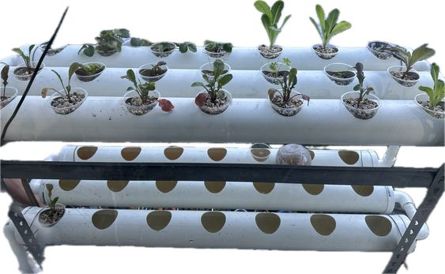
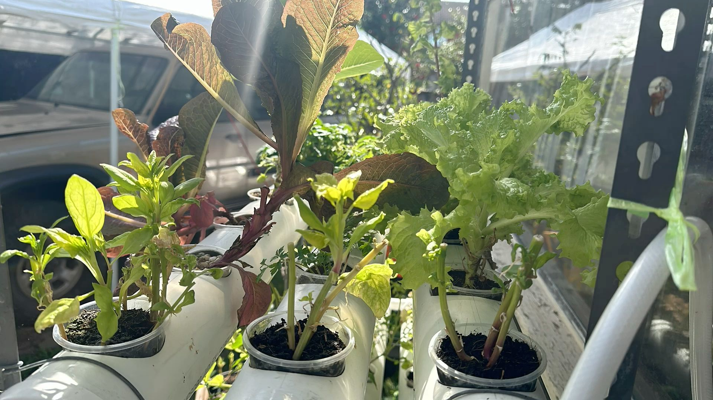

Starting a hydroponic garden at the beginning of this year was a mix of excitement and overwhelm. The journey involved figuring out the right growing medium, nutrients, plant varieties, water pH, EC levels, temperature control, and setting up the right system to support all these elements.

## May 14: The Beginnings

It all started with two basic [Hydro planters](https://www.bunnings.com.au/hydro-planter_p0207206?srsltid=AfmBOoofyeFJ0N1TsaARcMLbb4OhAFZRgRXwBnPbs-1WU_66uV9-gJBV) from Bunnings, a thoughtful gift from my family. I aimed to start with a small hydroponic garden, roughly the size of a goldfish bowl. Unfortunately, my initial choice of fish pebbles as a growing medium didn't work out well. The pebbles led to dirty water and frequent changes of the nutrient solution. A pump seemed like a good fix, but it also meant needing a larger container to accommodate all the plants.

## June: Troubles and Fixes

In June, I upgraded to clear rolling containers, drilling holes and attaching plastic cups to create makeshift net pots. While this setup was budget-friendly, it came with its own set of problems. The sunlight heating up the water reservoir caused bacterial growth, which negatively impacted my plants.

## July-August: The Big Upgrade

With a budget of AUD 100, I decided to build a more sophisticated system using PVC pipes from Bunnings. This upgrade allowed for better space management and a larger growing area. I could now support more plants and create a more stable environment for them. These are the pictures that I took today. As of date, I've been eating some healthy leaves by trimming a leaf from each of them here and there.

---

**What I’ve Learned:**

## Step 1: Gather Your Materials

**Essential Equipment:**

- **Hydroponic Planters:** Start with basic hydroponic planters or containers. You can experiment with different types to see what works best for you.
- **Growing Medium:** Choose an inert growing medium such as coir peat, rock wool, or hydroton clay pellets. I initially used fish pebbles, but coir peat or hydroton clay pellets are better alternatives.
- **Water Pump:** A water pump helps circulate the nutrient solution, preventing stagnation and bacterial growth.
- **Nutrient Solution:** Hydroponic plants require a special nutrient solution. Mix it according to the manufacturer's instructions.
- **pH and EC Meters:** These tools help monitor the pH and electrical conductivity (EC) of your nutrient solution.
- **Plastic Containers:** Clear rolling containers or larger bins are useful for holding your nutrient solution and growing medium.

## Step 2: Setting Up Your Initial System

1. **Assemble Your Planters:** Set up your hydro planters. Modify inexpensive containers if needed. For example, I used clear rolling containers, drilled holes, and attached plastic cups as netted pots.
   
2. **Prepare the Growing Medium:** Fill the planters with your chosen growing medium. Ensure it is well-drained and supports plant roots.

3. **Install the Water Pump:** Place the pump in the nutrient reservoir, making sure it effectively circulates the water and nutrient solution.

4. **Mix the Nutrient Solution:** Follow the instructions on your nutrient solution package. Use pH and EC meters to ensure the solution is within the ideal ranges.

5. **Set Up the Reservoir:** Place your nutrient solution in a large container or reservoir. If using clear containers, cover them to reduce light exposure and prevent algae growth.

## Step 3: Monitor and Maintain

1. **Check Water Temperature:** Regularly check the temperature of your nutrient solution. Excessive heat can cause bacterial growth, so keep the reservoir in a cool, shaded area.

2. **Adjust pH and EC:** Use your meters to monitor and adjust the pH and EC levels of the nutrient solution to ensure optimal plant growth.

3. **Replace the Nutrient Solution:** Replace the nutrient solution every few weeks or as needed based on the health of your plants.

4. **Prevent Algae Growth:** Cover the nutrient reservoir with a lid or opaque material to block out light and prevent algae problems.

## Step 4: Expand and Improve

1. **Upgrade Your System:** With a budget of AUD 100, I transitioned to a larger system using PVC pipes from Bunnings. This allowed for more plants and better space management. You might also consider other hydroponic systems like Deep Water Culture (DWC) or Nutrient Film Technique (NFT) as you gain experience.

2. **Learn and Adapt:** Experiment with different growing mediums, nutrient solutions, and plant varieties to optimize your hydroponic garden.

3. **Invest in Better Equipment:** As your budget allows, consider investing in high-quality pumps, grow lights, and advanced pH/EC meters to enhance your system's efficiency and plant health.

## Conclusion

Starting a hydroponic system requires careful planning and adjustment. With the right setup, you can create a successful indoor garden. Begin with basic equipment, monitor your system regularly, and be prepared to make improvements as you learn more about hydroponic gardening. Happy growing!