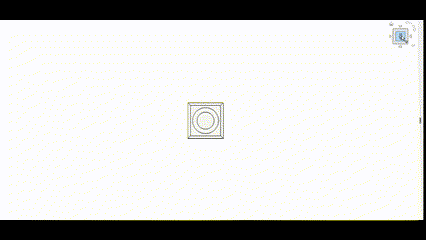
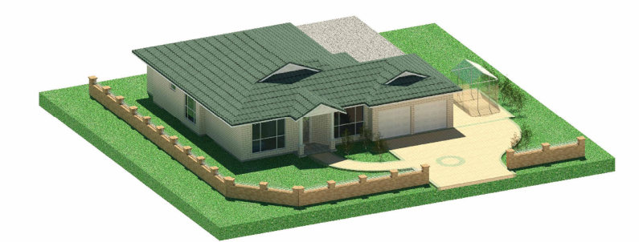
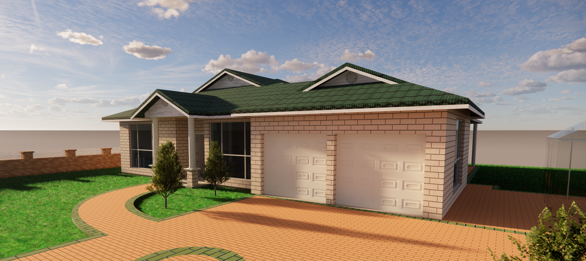
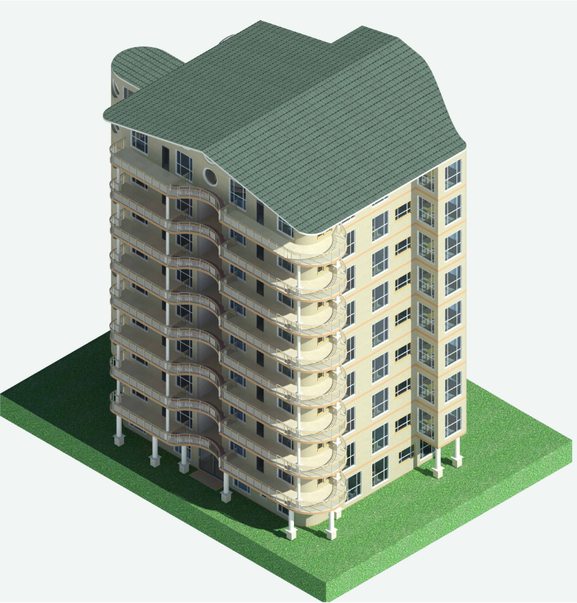

In 2023, during my undergraduate studies at UNSW, I had the opportunity to dive deeply into Building Information Modeling (BIM) through the architecture course CODE2170. This course was all about mastering Revit, a key tool in architectural design. My role involved creating detailed 3D renderings, floor plans, elevations, sections, and area schedules for various types of buildings, including residential homes, housing complexes, and community centers.

A major part of my work was developing 3D renderings in Revit. I set up camera views, applied materials, and adjusted lighting to produce realistic visualizations of our designs. This helped in presenting our ideas clearly and effectively. I also focused on creating comprehensive documentation, including floor plans where I precisely placed walls, doors, and windows; elevations showing the exterior of the buildings; and sections providing vertical cuts through the structure to highlight interior details.

Another important aspect was managing area schedules. Using Revit’s tools, I calculated floor areas, room volumes, and other metrics to ensure our designs met spatial requirements and building codes. This meticulous documentation was essential for both design accuracy and compliance.

Working with a group of international university students added a unique dimension to the project. We used Revit’s collaborative features, such as worksharing, to manage simultaneous modifications and integrate everyone’s work seamlessly. This experience required careful coordination to avoid conflicts and maintain consistency throughout our project.

This project not only advanced my Revit skills—such as mastering the Family Editor for creating custom components and using the Annotation Tool for detailed notes—but also provided valuable experience in handling complex BIM projects. I learned how to leverage Revit’s features for precise modeling and how to collaborate effectively within a diverse group of peers.

Overall, CODE2170 was an incredible chance to develop my technical skills in Revit and tackle real-world architectural challenges.

